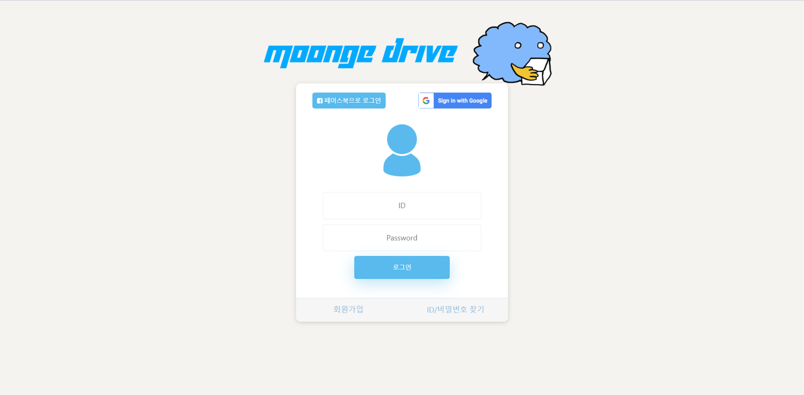
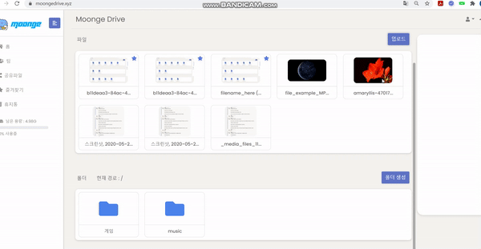
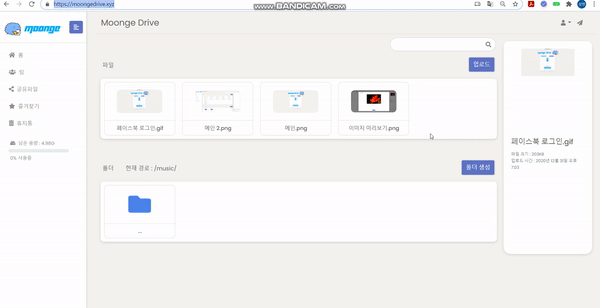

간편하게 사용할 수 있는 웹 클라우드 스토리지 - Moonge drive
----------------------------------------------------------

#### 웹 브라우저를 통해 누구나 간편하게 사용할 수 있는 웹 클라우드 저장소입니다. 
</img> 
</img>       

사용 방법
----------
https://moongedrive.xyz 로 접속해주세요.

지원 기능
----------
* 5GB의 private storage

* 이미지 파일 미리보기, 동영상 파일 스트리밍 기능

* 팀 생성을 통한 다른 사용자와의 파일 공유 기능

* 폴더를 생성하여 업로드한 파일을 손쉽게 정리할 수 있음.

* 파일 및 폴더 즐겨찾기, 경로 변경, 이름 변경, 휴지통 등 다양한 파일 관리 기능

* JWT 토큰과 OAuth2를 이용한 구글, 페이스북 로그인

* 사이트 가입자를 위한 메일 인증 시스템 

* 프로필 수정 및 회원 탈퇴 기능

사용 기술 스택 / 프레임워크
--------------
> Front-end
  > * React.js
  > * HTML
  > * CSS

> Web server
  > * Nginx

> WAS
  > * Django REST Framework

> Database
  > * PostgreSQL

> Others
  > * Docker
  > * AWS
  
참고한 라이브러리
-------------
> flow.js (https://github.com/flowjs/flow.js)

  파일 업로드 도중 일시정지나 취소, 재개를 구현하기 위해 사용한 front-end 라이브러리입니다. 파일을 chunk 단위로 잘라 전송하므로 파일 업로드 시 서버의 메모리 부하를 줄여줄 수 있습니다. 
        
      
> streamsaver.js (https://github.com/jimmywarting/StreamSaver.js)

  파일 다운로드를 구현하기 위해 사용한 front-end 라이브러리입니다. 대용량 파일을 다운로드 받을 때 사용자의 메모리를 거쳤다가 디스크에 저장되는데, 이 과정에서 사용자의 메모리 부족으로 인해 다운로드가 제대로 수행되지 않는 현상을 해결하기 위해 사용했습니다. WriteableStream을 이용하여 사용자의 메모리를 거치지 않고 사용자의 파일시스템에 직접적으로 파일을 다운로드 받을 수 있게 해줍니다.
       

> mod_zip (https://github.com/evanmiller/mod_zip) 

  여러 개의 파일들을 동시에 다운로드 받을 때 파일들을 압축해서 사용자에게 제공해주는 Nginx의 라이브러리입니다. Nginx가 파일들의 압축을 대신 수행하여 WAS의 부하를 줄여주는 역할을 합니다. DRF에서 사용
  하기 위해 python 라이브러리인 django-zip-stream과 함께 사용했습니다.(https://github.com/travcunn/django-zip-stream)

                                                      
사용 예시
-------------

1. 구글 / 페이스북 로그인

</img> 
</img> 

2. 파일 업로드 / 다운로드

</img> 
</img> 

3. 이미지 / 동영상 미리보기

</img> 
</img> 

업데이트 내역은 history.md 파일에서 확인하실 수 있으며, 작업 커밋 내역은 https://github.com/milesand/capstone-project 에서 확인하실 수 있습니다.
